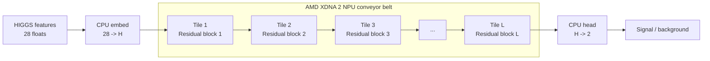

# NPU-Native Neural Networks

This repository accompanies a research paper on co-designing a residual MLP for
AMD XDNA 2. The central idea is deliberately simple: keep one residual weight
matrix per compute tile, stream activations across the array as a conveyor
belt, and evaluate the design on the HIGGS benchmark, where both throughput and
latency matter.

The codebase is intentionally narrow. It keeps only the pieces needed to
support that story:

- HIGGS data preparation and normalization
- CPU/GPU training for the residual MLP
- MLflow + Optuna tuning for full-data HIGGS runs
- forward-only streaming NPU inference for the residual body
- the whitepaper and supporting figures

The paper itself lives in `docs/whitepaper.tex` and `docs/whitepaper.pdf`.

## Headline results

| Result | Value |
| --- | --- |
| Best throughput point | `H=32, L=8`, CPU head, about **2.38M samples/s** wall-clock |
| Best full-data manual run | `H=32, L=32`, 20-epoch schedule, **76.98%** test acc., **0.8542** ROC AUC |
| Best validation-selected tuning result | `H=64, L=32`, **77.98%** test acc., **0.8653** ROC AUC, **0.8770** PR AUC |
| Validated NPU platform | AMD Ryzen AI 9 HX 370 / XDNA 2 |

## Direct mapping from network to hardware

The logical deployment path is:



A few design rules follow directly from the hardware:

- one residual matrix lives on one compute tile
- widths and batch sizes are chosen in multiples of 8 to match the MMUL path
- the current best wall-clock path keeps the `28 -> H` embed and `H -> 2` head
  on CPU and pushes the residual body to the NPU
- `L=8` uses 2 columns, while `L=32` can occupy the full 8-column array

This is the reason the codebase stays small: the model, runtime contract, and
hardware mapping line up closely enough that the paper can be validated without
wading through many unrelated architectures.

## Why HIGGS?

HIGGS is a much better fit for this project than image-classification toy tasks.
It is a dense 28-feature binary classification problem derived from collider
events, so a residual MLP is structurally plausible before any hardware
argument is made. That makes the throughput story easier to defend as a systems
result: the workload already looks like the kind of dense event filtering for
which low latency and high sustained throughput are genuinely useful.

## Hardware and driver requirements

Not every machine can run the full repository.

- CPU-only data prep, evaluation, and basic training can run on any recent
  Linux machine with a working Python environment.
- Full-data HIGGS training is much more practical on a recent GPU. The reported
  AMD GPU runs used a ROCm-enabled PyTorch build.
- The forward-only conveyor-belt NPU path requires AMD XDNA2 hardware on Linux,
  together with the AMD runtime/toolchain stack.

For the NPU path, assume the following prerequisites before trying to compile
or run `resmlp.streaming_infer`:

- AMD XDNA2 hardware such as Ryzen AI 300 / Strix Point class systems
  (validated here on AMD Ryzen AI 9 HX 370)
- Linux with the `amdxdna` / XRT stack installed and working
- `source /opt/xilinx/xrt/setup.sh` available in your shell
- `IRON` installed as an editable Python package
- `mlir-aie` available in the same Python environment

If you do not have that hardware/runtime stack, you can still use the HIGGS
training, evaluation, and tuning parts of the codebase.

## Installation

```bash
python -m venv .venv
source .venv/bin/activate
python -m pip install --upgrade pip
python -m pip install -r requirements.txt
```

For AMD GPU training, install a ROCm-enabled PyTorch wheel instead of the
default CPU build, for example:

```bash
python -m pip install torch --index-url https://download.pytorch.org/whl/rocm6.3
```

For the XDNA2 NPU path you also need the AMD runtime/toolchain stack:

```bash
python -m pip install -e /path/to/IRON
source /opt/xilinx/xrt/setup.sh
```

`requirements.txt` covers the pip-installable Python dependencies kept in this
repository. The hardware path still depends on a working XRT installation and
an editable `IRON` checkout.

## Reproducing the paper path

### 1. Prepare the full HIGGS cache

```bash
python -m resmlp.prepare_higgs_cache \
  --data-dir data/higgs_full \
  --train-splits train \
  --test-splits test
```

This materializes a split-aware `data/higgs_full/HIGGS.pt` cache from the
public `jxie/higgs` mirror.

### 2. Train a strong HIGGS model on GPU

```bash
python -m resmlp.train \
  --data-dir data/higgs_full \
  --device cuda \
  --epochs 50 \
  --save-dir build/higgs_h64_l32
```

The current defaults target the strongest region found so far:
`H=64`, `L=32`, AdamW, cosine decay, moderate label smoothing, and full-data
validation.

### 3. Launch an MLflow + Optuna sweep

```bash
python -m resmlp.tune_higgs_optuna \
  --data-dir data/higgs_full \
  --device cuda \
  --study-name higgs-full-exploit \
  --experiment-name higgs-full-optuna
```

MLflow logs go under `mlruns/` and the Optuna study state lives in
`build/higgs_optuna.db`.

### 4. Benchmark the conveyor-belt NPU path

```bash
python -m resmlp.streaming_infer build/higgs_h64_l32/resmlp_best.pt \
  --data-dir data/higgs_full \
  --batch-size 8 \
  --num-cols 8 \
  --stream-depth 32 \
  --bench-samples 50000000
```

The paper throughput table uses `B=8` and `stream_depth=32`. Use a smaller
`--num-cols` value for shallower checkpoints. For the strongest throughput
point (`H=32, L=8`), the current best wall-clock path keeps the tiny classifier
head on CPU.

## Historical material

Earlier MNIST, CIFAR, convnet, and full backward-pass experiments live on the
`experimental` branch.
