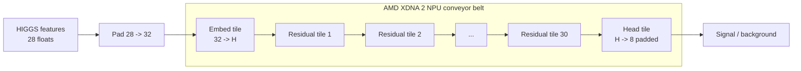

# NPU-Native Neural Networks

This repository accompanies a research paper on co-designing a residual MLP for
AMD XDNA 2. The central idea is deliberately simple: keep one residual weight
matrix per compute tile, stream activations across the array as a conveyor
belt, and evaluate the design on the HIGGS benchmark, where both throughput and
latency matter.

The codebase is intentionally narrow. It keeps only the pieces needed to
support that story:

- HIGGS data preparation and normalization
- CPU/GPU training for the residual MLP
- MLflow + Optuna tuning for full-data HIGGS runs
- forward-only streaming full-NPU inference: embed tile + 30 residual tiles + head tile
- the whitepaper and supporting figures

The paper itself lives in `docs/whitepaper.tex` and `docs/whitepaper.pdf`.

## Headline results

| Result | Value |
| --- | --- |
| Throughput | `H=32, L=30`, full-NPU, **14.08M samples/s** wall-clock at `B=64` (**2.44M** at `B=8`) |
| Accuracy | `H=32, L=30`, **76.61%** test acc., **0.8507** ROC AUC |
| CPU baseline (same host) | **0.98M** samples/s peak (12-core Ryzen AI, NumPy) — NPU is ~14× faster at best operating points |
| Validated NPU platform | AMD Ryzen AI 9 HX 370 / XDNA 2 |

## Direct mapping from network to hardware

The logical deployment path is:



A few design rules follow directly from the hardware:

- one residual matrix lives on one compute tile
- widths and batch sizes are chosen in multiples of 8 to match the MMUL path
- the first tile runs the padded `32 -> H` embed; the last tile runs the
  padded `H -> 8` head; the remaining 30 tiles run the residual body
- the full 32-tile array is used end-to-end; there is no CPU embed or CPU head
  on the inference hot path
- the current leader is `H=32, L=30`, which reaches about `14.08M` samples/s at
  `B=64`

This is the reason the codebase stays small: the model, runtime contract, and
hardware mapping line up closely enough that the paper can be validated without
wading through many unrelated architectures.

## Why HIGGS?

HIGGS is a much better fit for this project than image-classification toy tasks.
It is a dense 28-feature binary classification problem derived from collider
events, so a residual MLP is structurally plausible before any hardware
argument is made. That makes the throughput story easier to defend as a systems
result: the workload already looks like the kind of dense event filtering for
which low latency and high sustained throughput are genuinely useful.

## Hardware and driver requirements

Not every machine can run the full repository.

- CPU-only data prep, evaluation, and basic training can run on any recent
  Linux machine with a working Python environment.
- Full-data HIGGS training is much more practical on a recent GPU. The reported
  AMD GPU runs used a ROCm-enabled PyTorch build.
- The forward-only conveyor-belt NPU path requires AMD XDNA2 hardware on Linux,
  together with the AMD runtime/toolchain stack.

For the NPU path, assume the following prerequisites before trying to compile
or run `resmlp.streaming_infer`:

- AMD XDNA2 hardware such as Ryzen AI 300 / Strix Point class systems
  (validated here on AMD Ryzen AI 9 HX 370)
- Linux with the `amdxdna` / XRT stack installed and working
- `source /opt/xilinx/xrt/setup.sh` available in your shell
- `IRON` installed as an editable Python package
- `mlir-aie` available in the same Python environment

If you do not have that hardware/runtime stack, you can still use the HIGGS
training, evaluation, and tuning parts of the codebase.

## Installation

```bash
python -m venv .venv
source .venv/bin/activate
python -m pip install --upgrade pip
python -m pip install -r requirements.txt
```

For AMD GPU training, install a ROCm-enabled PyTorch wheel instead of the
default CPU build, for example:

```bash
python -m pip install torch --index-url https://download.pytorch.org/whl/rocm6.3
```

For the XDNA2 NPU path you also need the AMD runtime/toolchain stack:

```bash
python -m pip install -e /path/to/IRON
source /opt/xilinx/xrt/setup.sh
```

`requirements.txt` covers the pip-installable Python dependencies kept in this
repository. The hardware path still depends on a working XRT installation and
an editable `IRON` checkout.

## Reproducing the paper path

### 1. Prepare the full HIGGS cache

```bash
python -m resmlp.prepare_higgs_cache \
  --data-dir data/higgs_full \
  --train-splits train \
  --test-splits test
```

This materializes a split-aware `data/higgs_full/HIGGS.pt` cache from the
public `jxie/higgs` mirror.

### 2. Train the full-NPU `H=32, L=30` checkpoint

```bash
python -m resmlp.train \
  --data-dir data/higgs_full \
  --device cuda \
  --hidden-dim 32 \
  --num-layers 30 \
  --epochs 20 \
  --batch-size 8192 \
  --lr 3e-3 \
  --min-lr 1e-4 \
  --weight-decay 1e-4 \
  --label-smoothing 0 \
  --save-dir build/higgs_full_h32_l30
```

The residual body uses 30 layers so that embed and head each get one of the 32
NPU tiles.

### 3. Benchmark the conveyor-belt NPU path

```bash
python -m resmlp.streaming_infer build/higgs_full_h32_l30/resmlp_best.pt \
  --data-dir data/higgs_full \
  --batch-size 64 \
  --num-cols 8 \
  --stream-depth 32 \
  --bench-samples 50000000
```

The paper throughput table uses `stream_depth=32` and reports `B=8` and `B=64`.
The full-NPU checkpoint reaches about **2.44M samples/s** at `B=8` and
**14.08M samples/s** at `B=64`.

### 4. Compare to the same-host CPU baseline

```bash
python -m resmlp.cpu_baseline \
  --hidden-dim 32 --num-layers 30 \
  --batch-sizes 8 64 256 1024 \
  --num-samples 5000000
```

On the same 12-core Ryzen AI host the peak CPU throughput is about
`0.98M samples/s` (NumPy, `B=256`), so the NPU path is roughly `14×` faster at
its best operating point and `17×` faster at `B=8`.

## Historical material

Earlier MNIST, CIFAR, convnet, and full backward-pass experiments live on the
`experimental` branch.
