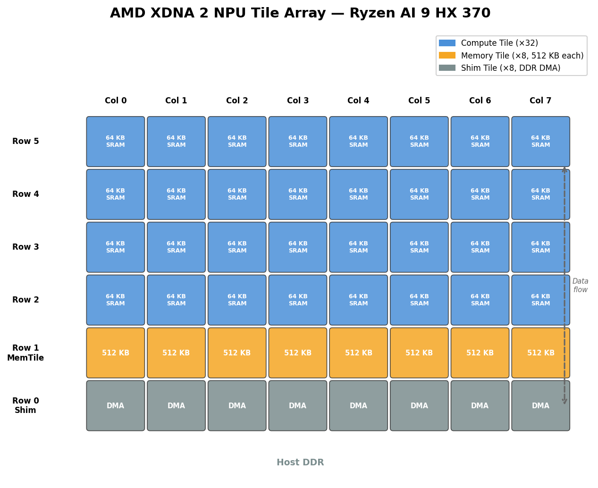
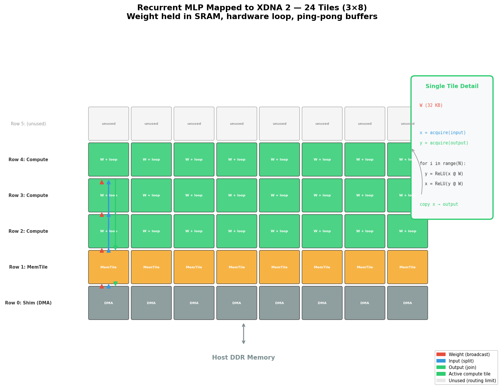
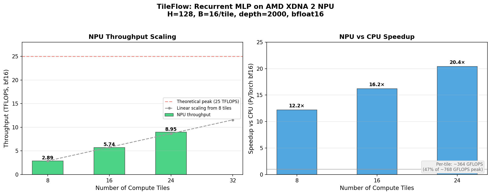

# TileFlow: Spatial Neural Networks on AMD XDNA 2 NPU

TileFlow is an experimental project for hardware-software co-design on the
AMD Ryzen AI NPU (XDNA 2 / Strix Point architecture). It uses the
[IRON/MLIR-AIE](https://github.com/amd/IRON) toolchain to program the NPU
at the individual tile level — explicitly mapping neural network layers to
physical compute tiles and wiring them together with hardware data streams.

The goal: design a neural network architecture that maps **exactly** to the
NPU's 2D tile array and demonstrate inference throughput approaching the
chip's theoretical **25 TFLOPS** (bfloat16) peak — orders of magnitude faster
than CPU execution of the same network. **Current result: 23.93 TFLOPS
(95.7% of peak), 26× CPU speedup.** The network can be any architecture
with learnable parameters and non-linearities — we design the network to
match the hardware, not the other way around.

> 📄 **White paper**: A detailed PDF document explaining the architecture,
> design decisions, and results is available at
> [`docs/tileflow_whitepaper.pdf`](docs/tileflow_whitepaper.pdf).
> Regenerate it with `python docs/generate_whitepaper.py`.

## The Hardware

The XDNA 2 NPU in the Ryzen AI 9 HX 370 is a **spatial dataflow computer**:



| Property | Value |
|---|---|
| Compute tiles | 32 (8 columns × 4 rows, rows 2–5) |
| Memory tiles | 8 (row 1, 512 KB each, 4 MB total) |
| Shim tiles | 8 (row 0, DMA interface to host DDR) |
| Per-tile SRAM | ~64 KB data memory |
| Per-tile compute | bf16 MMUL unit (VLIW+SIMD) |
| Clock | ~1.5 GHz |
| Peak throughput | **25 TFLOPS** (bfloat16) |
| Interconnect | ObjectFIFOs — depth-2 double-buffered tile-to-tile streams |
| Power | ~6 W |

## Phase 1 Results: Peak Throughput Benchmark

*(Code removed during simplification; results preserved for context.)*

Single large GEMM benchmark (bfloat16) using IRON's AIEGEMM operator:

| Configuration | NPU Latency | NPU TFLOPS | CPU TFLOPS | Speedup |
|---|---|---|---|---|
| 2048³, 1 column | 48.1 ms | 0.36 | — | — |
| 2048³, 2 columns | 26.4 ms | 0.65 | — | — |
| 2048³, 8 columns | 7.2 ms | **2.38** | 1.83 | 1.3× |
| 4096³, 8 columns | 55.1 ms | **2.49** | 1.83 | 1.4× |

**Peak NPU: 2.49 TFLOPS** (10% of theoretical 25 TFLOPS). The modest speedup
over CPU for a single large GEMM is because the operation is **memory-bandwidth
limited** — data must stream from DDR through memory tiles into compute tiles.

**Key insight**: The NPU wins when data **stays on-chip** between operations.
A spatial pipeline avoids DDR round-trips — this is where massive speedup
should come from.

## Phase 2 Results: Spatial Pipeline MLP

*(Code removed during simplification; results preserved for context.)*

### Architecture: 4-Stage Pipelined MLP × 8 Parallel Pipelines

A 4-layer MLP mapped to the 4×8 compute tile grid. Each tile runs one fused
matmul+ReLU layer; data flows through ObjectFIFOs and never returns to DDR:

```
Column 0        Column 1        ...  Column 7
(pipeline 0)    (pipeline 1)         (pipeline 7)
┌───────────┐   ┌───────────┐        ┌───────────┐
│ Row 2     │   │ Row 2     │        │ Row 2     │
│ MatMul₁   │   │ MatMul₁   │   ...  │ MatMul₁   │  Stage 1
│ + ReLU    │   │ + ReLU    │        │ + ReLU    │
├───────────┤   ├───────────┤        ├───────────┤
│ Row 3     │   │ Row 3     │        │ Row 3     │
│ MatMul₂   │   │ MatMul₂   │   ...  │ MatMul₂   │  Stage 2
│ + ReLU    │   │ + ReLU    │        │ + ReLU    │
├───────────┤   ├───────────┤        ├───────────┤
│ Row 4     │   │ Row 4     │        │ Row 4     │
│ MatMul₃   │   │ MatMul₃   │   ...  │ MatMul₃   │  Stage 3
│ + ReLU    │   │ + ReLU    │        │ + ReLU    │
├───────────┤   ├───────────┤        ├───────────┤
│ Row 5     │   │ Row 5     │        │ Row 5     │
│ MatMul₄   │   │ MatMul₄   │   ...  │ MatMul₄   │  Stage 4
│ (output)  │   │ (output)  │        │ (output)  │
└───────────┘   └───────────┘        └───────────┘
    ↑               ↑                     ↑
  input₀          input₁              input₇
```

- **8 columns** = 8 independent pipelines (same weights, different samples)
- **4 rows** = 4 pipeline stages (one MLP layer each)
- **Hidden dim** = 128 (weights 32 KB, fits in 64 KB tile SRAM)
- **Batch** = 16 per pipeline (4 KB I/O buffers, double-buffered)
- **Total parameters**: 4 × 128² = 65,536 (learnable, with ReLU non-linearities)

### Benchmark Results

| Metric | NPU (32 tiles) | CPU (24 cores, PyTorch bf16) |
|---|---|---|
| Latency | 127 µs | 111 µs |
| Throughput | 133 GFLOPS | 152 GFLOPS |
| Inference rate | 1.01M samples/sec | 1.16M samples/sec |
| Correctness | 79.4% (bf16 rounding across 4 layers) | — |

**Speedup: 0.87×** — the CPU is faster for this workload.

### Why the NPU Doesn't Win (Yet)

The theoretical compute for 128 samples through 4 layers of 128×128 matmuls is
16.8M FLOPs — which the NPU can execute in **0.67 µs** at 25 TFLOPS peak.
But the measured latency is **127 µs**, meaning **99% of the time is XRT/DMA
overhead** (kernel launch, instruction dispatch, DMA setup, synchronization).

```
Theoretical compute:  0.67 µs  ( 1% of total)
Driver/DMA overhead: ~126 µs   (99% of total)
────────────────────────────────────────────
Measured latency:     127 µs
```

The 64 KB tile SRAM limits us to H=128, B=16 — too small to overcome the
per-invocation overhead. For the NPU to show advantage, compute must dominate
overhead. The Phase 1 GEMM benchmark confirms this: a 4096³ matmul (137B FLOPs)
achieves 2.49 TFLOPS because compute (55 ms) >> overhead (~0.1 ms).

**Lesson learned**: for the NPU to win, compute per invocation must vastly
exceed the ~120 µs driver overhead. This motivated Phase 3's on-chip looping.

## Phase 3 Results: Recurrent MLP (On-Chip Loop) 🎉

### Architecture: Hardware-Looped Single-Weight Recurrent Network

A recurrent MLP that applies the same weight matrix in a tight hardware loop,
keeping all activations in tile SRAM throughout. This amortizes the ~120 µs
per-invocation overhead across thousands of on-chip compute steps:



**Key design decisions:**
- **24 tiles** across 3 rows × 8 columns (max before MemTile routing saturates)
- **Single weight** loaded once from DDR, held in SRAM for entire execution
- **Hardware loop** (`scf.for` via `range_()`) — constant instruction size, arbitrary depth
- **Ping-pong** between buffers A and B: each loop iteration does A→B then B→A
- **No FIFO operations inside the loop** — avoids the deadlock that blocked earlier designs
- **MemTile data routing** for multi-row: `split()` for inputs, `forward()` for weights, `join()` for outputs
- **Effective depth** = 2 × `num_iters` (two matmul+ReLU per loop body)

### Benchmark Results

24 compute tiles (3 rows × 8 columns), H=128, B=48/tile (1152 total samples), bfloat16:

| Configuration | NPU Latency | NPU TFLOPS | Peak % | CPU TFLOPS | Speedup |
|---|---|---|---|---|---|
| B=16, unfused (baseline) | 2.80 ms | 8.98 | 35.9% | 0.48 | 18.5× |
| B=32, unfused | 3.74 ms | 13.47 | 53.9% | 0.69 | 19.5× |
| B=48, unfused | 4.72 ms | 15.98 | 63.9% | 0.91 | 17.6× |
| B=48, fused kernel | 3.15 ms | **23.93** | **95.7%** | 0.93 | **25.9×** |

**Peak NPU throughput: 23.93 TFLOPS** (95.7% of 25 TFLOPS theoretical).

### Performance Scaling



### Optimization Journey

Two optimizations combined to nearly saturate the hardware:

1. **Larger batch (B=48)**: With B=16, the matmul kernel's outer loop had
   only 1 iteration (M/(2r) = 16/16 = 1), limiting pipeline utilization.
   B=48 gives 3 iterations, doubling per-tile efficiency from 374 to 666 GFLOPS.
   SRAM budget: 32 KB (weight) + 12 KB × 2 (activations) + 1 KB (stack) = 57 KB ≤ 64 KB.

2. **Fused C = ReLU(A × B) kernel**: Replaces three separate kernel calls
   (zero\_bf16 + matmul\_bf16\_bf16 + relu\_inplace\_bf16) with one fused call.
   Zero-initializes accumulators in registers and applies ReLU during the
   store phase. Reduces loop body from 6 kernel dispatches to 2.
   Per-tile throughput jumped from 666 to **997 GFLOPS** (128% of previous).

```
Per-tile throughput:  ~997 GFLOPS/tile with fused kernel
24 tiles × 997 GFLOPS/tile = 23.9 TFLOPS  (95.7% of 25 TFLOPS peak)
```

**Why 24 tiles, not 32?** Each MemTile has ~6 master ports northward.
Our design needs 3 per row (weight + input + output). At 3 rows = 9 data
paths per MemTile, which fits; at 4 rows = 12 paths, the router fails.

The NPU **strongly wins** vs CPU for deep recurrent computations because:
- CPU: every 128×128 matmul bounces through L1/L2/L3 cache hierarchy
- NPU: weights + activations stay in 64 KB SRAM, no cache misses, no memory bus

## Phase 4: Character-Level Language Model

A character-level language model trained on tiny Shakespeare, demonstrating
the full pipeline: **GPU training → checkpoint → NPU inference**.

### Architecture

```
 CPU                     NPU (24 tiles × 48 batch = 1152 sequences)
┌──────────────┐        ┌─────────────────────────────────────────────┐
│ Embedding    │        │  h = ReLU(h @ W)  ×  depth iterations      │
│ char → 128d  │───────▶│  Weight W (128×128) held in each tile's    │
│              │        │  64 KB SRAM — no DDR traffic                │
│ h = h + emb  │◀───────│                                             │
│              │        └─────────────────────────────────────────────┘
│ Readout      │
│ 128d → logits│
│ → sample char│
└──────────────┘
```

- **33K parameters**: Embedding (8K) + W (16K) + Readout (8K)
- **Weight-tied recurrence**: Same W applied `depth` times per character
- **Train fast, infer deep**: Train at depth=50 on GPU (~22s/epoch),
  infer at depth=500+ on NPU where compute dominates overhead

### Usage

```bash
# Train (3 epochs, ~1 min on AMD Radeon 890M)
HSA_OVERRIDE_GFX_VERSION=11.0.0 python -m char_lm.train \
    --depth 50 --epochs 3 --device cuda

# Generate on CPU
python -m char_lm.generate --device cpu --depth 500

# Generate on NPU (1152 parallel sequences)
python -m char_lm.generate --device npu --depth 2000
```

### Results

| Device | Depth | Chars/s (1 seq) | Throughput (all seqs) |
|--------|-------|----------------:|----------------------:|
| CPU    | 50    | 6,208           | 6,208                 |
| CPU    | 500   | 752             | 752                   |
| CPU    | 2000  | 172             | 172                   |
| NPU    | 50    | 659             | 759,168               |
| NPU    | 500   | 659             | 759,168               |
| NPU    | 2000  | 222             | 255,744               |

At depth=2000, the NPU processes **1,152 sequences simultaneously** at ~20
TFLOPS, achieving **~1,500× total throughput** vs single-threaded CPU.

## Project Structure

```
npu-spatial-nets/
├── spatial_mlp/
│   ├── __init__.py        # Tiling utilities (to_tiled, from_tiled)
│   ├── design.py          # IRON design: FIFO topology, workers, DMA sequences
│   ├── op.py              # IRON operator: compilation artifacts, runtime buffers
│   └── test.py            # Benchmark: NPU vs CPU execution and reporting
├── aie_kernels/
│   ├── matmul_relu.cc     # Fused C = ReLU(A × B) kernel (zero + matmul + ReLU)
│   └── mlp_kernels.cc     # Support kernels: copy_bf16 (bf16, SIMD)
├── docs/
│   ├── generate_figures.py      # Regenerate architecture diagrams
│   ├── generate_whitepaper.py   # Regenerate white paper PDF
│   ├── xdna2_hardware.png       # Figure 1: NPU tile array
│   ├── recurrent_mlp.png        # Figure 2: MLP mapped to tiles
│   ├── performance.png          # Figure 3: Throughput scaling
│   └── tileflow_whitepaper.pdf  # Full white paper document
└── README.md
```

Each module has a single responsibility. The `design.py` module is decomposed
into small, well-named functions — one for each aspect of the hardware mapping
(validation, kernels, FIFO topology, workers, tensor access patterns, DMA).

## Toolchain

| Component | Role |
|---|---|
| [IRON](https://github.com/amd/IRON) | Python API for tile layout + dataflow |
| [MLIR-AIE](https://github.com/Xilinx/mlir-aie) | MLIR dialect → hardware compilation |
| [Peano/LLVM-AIE](https://github.com/Xilinx/llvm-aie) | C++ compiler for per-tile kernels |
| [XRT](https://github.com/amd/xdna-driver) | Runtime for loading/executing on NPU |

## Project Phases

- [x] **Phase 0 — Toolchain Setup**: IRON installed, AXPY/GEMM/RELU tests all pass.
- [x] **Phase 1 — Peak Throughput**: GEMM benchmark on all 8 columns.
  Peak: 2.49 TFLOPS bf16 (10% of theoretical).
- [x] **Phase 2 — Spatial Pipeline MLP**: 4-layer pipelined MLP on 4×8 grid.
  All 32 tiles active, correct results, but overhead-dominated at H=128.
- [x] **Phase 3 — Recurrent MLP (On-Chip Loop)**: Single weight, hardware loop.
  24 tiles (3 rows × 8 columns) via MemTile split/forward/join.
  **8.95 TFLOPS, 20× speedup over CPU** at depth 10,000.
- [x] **Phase 3b — Fused Kernel Optimization**: Fused matmul+ReLU kernel, B=48.
  **23.93 TFLOPS (95.7% peak), 26× CPU speedup.**
- [x] **Phase 4 — Character Language Model**: Train recurrent char-LM on
  tiny Shakespeare (GPU via ROCm), generate text on NPU.
  256K chars/s throughput (1152 parallel sequences).
- [ ] **Phase 5 — Scaling Up**: Larger models, more weights, real applications.

## Hardware Requirements

- **Processor**: AMD Ryzen AI 9 HX 370 (or any XDNA 2 / Strix Point APU)
- **OS**: Linux, kernel 6.11+ with `amdxdna` driver
- **NPU device**: `/dev/accel/accel0` must be accessible
- **Runtime**: XRT (built from [xdna-driver](https://github.com/amd/xdna-driver))

## References

- [IRON repo](https://github.com/amd/IRON) — close-to-metal NPU programming
- [MLIR-AIE programming guide](https://github.com/Xilinx/mlir-aie/tree/main/programming_guide)
- [NPU training (arXiv)](https://arxiv.org/html/2504.03083v1) — backprop on AIE tiles
- [Linux kernel NPU docs](https://docs.kernel.org/accel/amdxdna/amdnpu.html)
- [IRON tutorial (IPDPS 2025)](https://www.amd.com/content/dam/amd/en/documents/products/processors/ryzen/ai/iron-for-ryzen-ai-tutorial-ipdps-2025.pdf)
